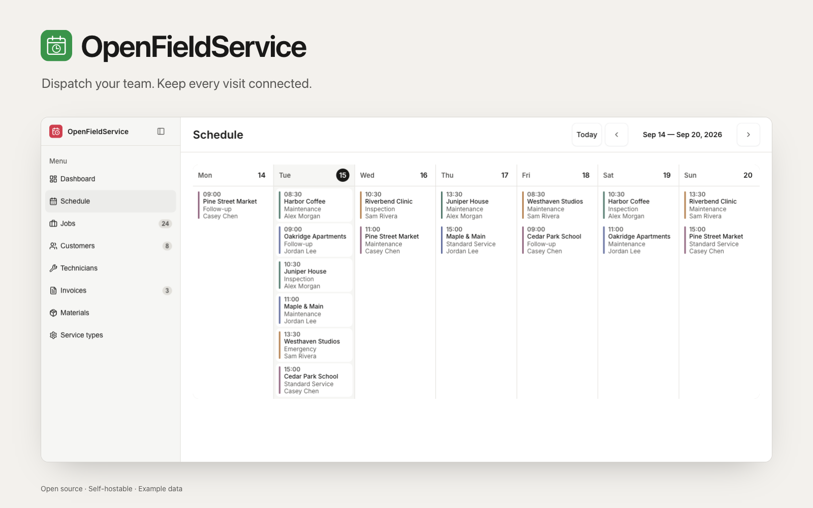
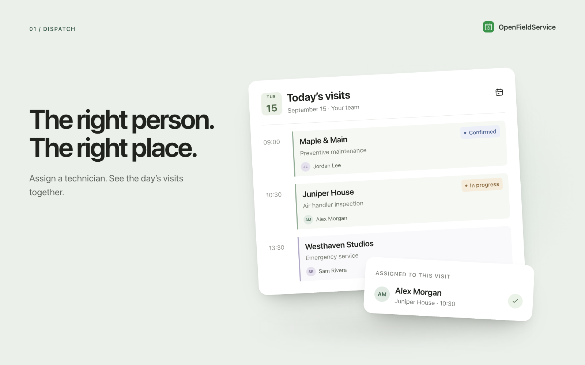
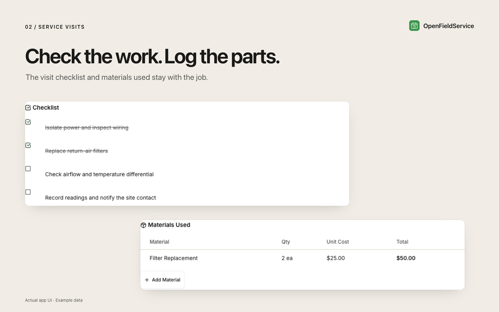
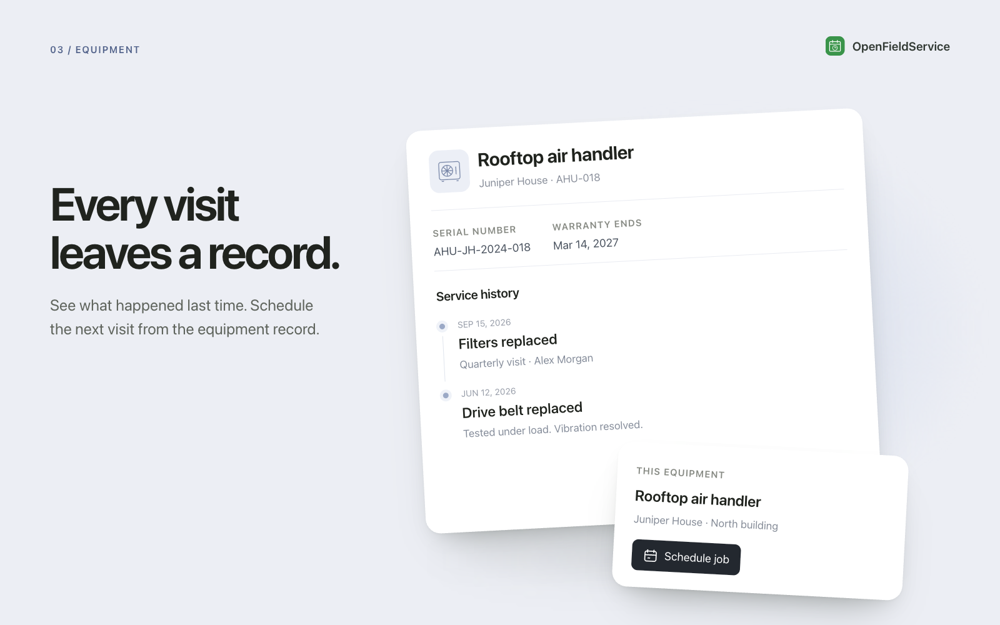
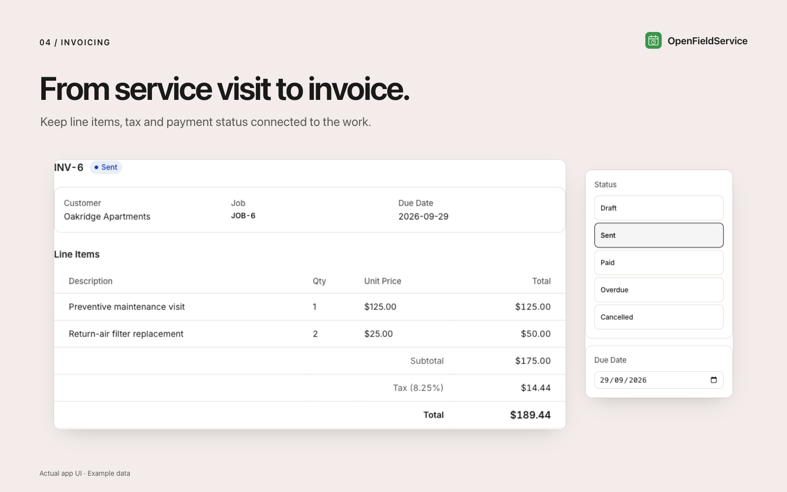

<picture>
  <source media="(prefers-color-scheme: dark)" srcset="readme-banner-dark.png" />
  
</picture>

# OpenFieldService: The Open-Source PestPac & ServiceTitan Alternative

[](https://app.clawnify.com/deploy?repo=clawnify/OpenFieldService)

A field service scheduling and business management app for service companies — pest control, HVAC, plumbing, cleaning, landscaping, and more. Part of the [OpenClaw](https://github.com/openclaw/openclaw) ecosystem. Zero cloud dependencies — runs locally with SQLite.

Built with **Preact + Hono + SQLite**. Ships with a clean dashboard UI, weekly calendar view, job management, customer database, invoicing, materials tracking, and technician dispatch.

## See it in action

Conceptual UI illustrations of the app’s main capabilities, with fictional example data. Open an image to see the details.

| Dispatch | Job checklists & materials |
| --- | --- |
| [](previews/dispatch.png) | [](previews/job-work.png) |
| **Equipment history** | **Invoicing** |
| [](previews/equipment-history.png) | [](previews/invoicing.png) |

## What Is It?

OpenFieldService is a production-ready field service management platform designed for the OpenClaw community. Think of it as an open-source alternative to **PestPac**, **ServiceTitan**, **FieldWork**, **Jobber**, or **Housecall Pro** — a complete scheduling and dispatch system you can self-host, customize, and embed in any SaaS product.

Unlike PestPac or ServiceTitan, this runs entirely on your own infrastructure. No per-user fees, no contracts, no vendor lock-in. Manage your entire field service operation from scheduling to invoicing.

## Built for Every Field Service Vertical

OpenFieldService is **vertical-agnostic** — configure service types, pricing, and workflows for any industry:

| Industry | Example Services |
|----------|-----------------|
| **Pest Control** | General pest treatment, termite inspection, rodent control, mosquito spray, bed bug treatment, wildlife removal |
| **HVAC** | AC repair, furnace installation, duct cleaning, maintenance plans, emergency service |
| **Plumbing** | Drain cleaning, pipe repair, water heater installation, sewer inspection, leak detection |
| **Cleaning** | House cleaning, deep clean, move-in/move-out, carpet cleaning, window washing |
| **Landscaping** | Lawn mowing, tree trimming, irrigation, hardscaping, seasonal cleanup |
| **Electrical** | Panel upgrade, outlet installation, lighting, ceiling fan, troubleshooting |
| **Pool Service** | Weekly maintenance, equipment repair, opening/closing, acid wash, leak repair |
| **Appliance Repair** | Washer/dryer, refrigerator, dishwasher, oven, garbage disposal |
| **Locksmith** | Residential lockout, lock rekey, deadbolt install, key duplication, safe opening |
| **Painting** | Interior painting, exterior painting, cabinet refinishing, power washing, staining |
| **Roofing** | Inspection, leak repair, shingle replacement, gutter cleaning, full replacement |
| **Garage Door** | Spring repair, opener install, panel replacement, tune-up, emergency service |

## Features

- **Job scheduling** — create, assign, and track service visits with date/time scheduling, priority levels, and status workflow
- **Weekly calendar view** — visual schedule grid with technician color coding and week navigation
- **Customer management** — full CRM with contact info, addresses, service history, and notes
- **Optional equipment records** — customer sites, serialized equipment, lifecycle status, installation/commissioning and warranty dates, and a chronological service history
- **Technician dispatch** — assign techs to jobs, track active workloads, toggle availability
- **Service type catalog** — configurable services with default pricing and durations per vertical
- **Invoicing** — generate invoices from completed jobs, track draft/sent/paid/overdue status, line item details
- **Materials tracking** — log materials used on each job with costs, maintain inventory
- **Job checklists** — inspection forms and task lists per job with check/uncheck
- **Activity log** — timestamped notes on every job for internal communication
- **Dashboard** — at-a-glance KPIs: today's schedule, upcoming jobs, revenue, outstanding invoices
- **Search & filter** — find jobs by status, search customers by name/phone/address
- **URL routing** — bookmarkable pages (`/jobs`, `/customers/:uuid`, `/invoices`, `/schedule`)
- **Dual-mode UI** — human-optimized + AI-agent-optimized (`?agent`)
- **Offline field access** — saves the current schedule and today’s job packets on-device for read-only use when signal drops

## Quickstart

```bash
git clone https://github.com/clawnify/OpenFieldService.git
cd OpenFieldService
pnpm install
pnpm run dev
```

Open the local URL printed by Vite (usually `http://localhost:5173`). The API runs on port 8787. Local D1 data persists in `.wrangler/state/`. `pnpm run dev` creates the schema for a fresh database. Existing integer-ID databases require the explicit UUID migration below.

### Sites and equipment (optional)

Open a customer profile and use **Sites & equipment** to add locations, site
contacts, timezones, access instructions, and safety notes. Register each piece
of equipment with its serial number and site; serial numbers are unique within
a customer, ignoring case. Search by name, serial number, or model and open an
equipment card to view its bookmarkable detail page (`/assets/:id`).

From an equipment detail page, choose **Schedule job** to open the job form with
the customer and equipment already selected. Choose a date, service, and technician;
saving opens the new job. Changing the customer clears the equipment selection.
Cancel returns to the equipment record without creating a job.

When creating a job, optionally select equipment. A blank job address uses the
equipment site's address, falling back to the customer address if the site has
none. Existing jobs can be linked or unlinked from **Job → Equipment**. Changing
a link or moving equipment does not change an existing job's address.

**Edit equipment** supports moves between the same customer's sites and lifecycle
status changes. Registration, moves, status changes, linked job changes, and new
job notes appear in its history. History snapshots remain after a job is unlinked
or deleted; surviving jobs link through to their checklists and materials.
Equipment and sites are retained rather than deleted, and customers with sites
cannot be deleted. Use the equipment's **Retired** status when it leaves service.
Lifecycle status is a business record, not a telemetry-based health assessment.

This is the first delivery slice of issue #6. Ownership transfers, component
hierarchies, support cases, maintenance plans, parts applicability, coverage
adjudication, customer portals, and telemetry ingestion are not included.
Warranty dates are recorded; coverage decisions are not inferred from them.

### UUID record IDs and existing databases

Every record uses a UUID: customers, jobs, sites, equipment, technicians,
service types, notes, checklist items, materials, invoices, invoice lines, and
history events. API relationships and detail URLs use UUID strings. Readable
job/invoice labels (`JOB-42`, `INV-8`) remain for staff; their counters are atomic.

**Existing databases require a migration before this version can run.** An
additive deployment schema update cannot change primary-key types. The API
returns an upgrade-required error on the old schema instead of accepting writes.

For local Wrangler/D1, stop the app and back up `.wrangler/state/`, then run:

```bash
pnpm db:migrate-uuids
pnpm dev
```

The migration copies records with UUIDs, remaps every relationship, checks row
counts and foreign keys, and replaces the tables in one atomic D1 batch. Retained
history (including references to deleted jobs), timestamps, display labels, and
counter values survive. Repeating the migration is a no-op. Custom tables, indexes, columns, and
triggers require an explicit migration rather than silently dropping them.
Old numeric bookmarks/API IDs must be replaced with UUIDs; find the record by
its existing name, serial number, or job/invoice label.

The setup script is **local only**. For an existing hosted database, stop writes,
back it up, and apply an equivalent migration using its actual schema through
your database administration process **before deploying this code**. The migration
builder is `scripts/uuid-migration.mjs`; it accepts the schema, actual table
columns, and trigger names. Never reset a populated database to adopt UUIDs.

Run `pnpm test` for migration preservation/rollback checks and real local D1
workflows, including UUID relations, concurrent record creation, and invoicing.
Tests create and remove their own databases and never use a remote database.

### Offline field access

After an online visit, the current schedule and today’s full job packets are saved
in that browser. If connectivity drops, refresh the app to keep reading the saved
customer, address, notes, checklist, and materials for those jobs. A visible banner
marks saved data, and create, edit, delete, and week-navigation controls stay disabled
until live data returns. Jobs outside the saved set say that they must be opened online
first instead of showing an empty record.

Offline data can contain customer details. While saved data exists, the connection banner
stays available online so you can use **Clear saved data** before handing a device to
another person. Clearing also pauses field-data caching across reloads until you choose
**Enable offline access**. Offline writes are deliberately not queued: a job update must
reach the server before the app claims it was saved.

### Appearance

The UI follows the Clawnify app instruction system: white content, a warm neutral
sidebar, ink primary actions, semantic status badges, full-width tables, and
compact stat tiles. Shared colours, spacing, and radii live in
`src/client/tokens.css`. Dark mode follows the system appearance. On phones,
controls grow to touch size and tables scroll within their own region.

### Agent Mode (for OpenClaw / Claude Code)

Append `?agent` to the URL:

```
http://localhost:5174/?agent
```

This activates an agent-friendly UI with:
- Explicit delete/action buttons always visible (no hover-to-reveal)
- Large click targets for reliable browser automation
- All controls accessible without drag interactions

### Using with Claude Code

Claude Code can interact with the scheduler through the REST API:

```bash
# Create a customer
curl -X POST http://localhost:8787/api/customers \
  -H "Content-Type: application/json" \
  -d '{"name": "John Smith", "phone": "(555) 123-4567", "address": "123 Main St", "city": "Austin", "state": "TX"}'

# Schedule a job
curl -X POST http://localhost:8787/api/jobs \
  -H "Content-Type: application/json" \
  -d '{"customer_id": "<customer-uuid>", "service_type_id": "<service-type-uuid>", "technician_id": "<technician-uuid>", "scheduled_date": "2025-01-15", "scheduled_time": "09:00"}'

# Generate an invoice using the UUID returned when the job was created
JOB_ID="<job-uuid>"
curl -X POST "http://localhost:8787/api/jobs/$JOB_ID/invoice"
```

## Tech Stack

| Layer | Technology |
|-------|-----------|
| **Frontend** | Preact, TypeScript, Vite |
| **Backend** | Hono, Node.js |
| **Database** | SQLite (better-sqlite3) |
| **Validation** | Zod, @hono/zod-openapi |
| **Icons** | Lucide |

### Prerequisites

- Node.js 22+ (required by the locked Wrangler version)
- pnpm (or npm/yarn)

## Architecture

```
src/
  server/
    schema.sql  — SQLite schema (customers, jobs, technicians, invoices, materials)
    db.ts       — SQLite wrapper (query, get, run, transaction)
    index.ts    — Hono REST API with OpenAPI schemas
    dev.ts      — Dev server with static file serving
  client/
    app.tsx           — Root component with URL routing
    context.tsx       — App context (state interface)
    hooks/
      use-app.ts      — State management, CRUD operations, API calls
      use-router.ts   — pushState URL routing
    components/
      sidebar.tsx          — Navigation with job/customer counts
      dashboard.tsx        — Stats cards + today's schedule
      schedule-view.tsx    — Weekly calendar grid
      job-list.tsx         — Paginated job list with status filters
      job-row.tsx          — Job table row
      job-detail.tsx       — Job detail with checklist, materials, notes
      create-job.tsx       — New job modal
      customer-list.tsx    — Paginated customer list with search
      customer-detail.tsx  — Customer profile + service history
      create-customer.tsx  — New customer modal
      technician-list.tsx  — Technician management with inline edit
      create-technician.tsx — New technician modal
      service-type-list.tsx — Service catalog with inline edit
      create-service-type.tsx — New service type modal
      invoice-list.tsx     — Invoice list with status filters
      invoice-detail.tsx   — Invoice detail with line items
      material-list.tsx    — Materials/inventory management
      status-badge.tsx     — Status and priority badges
      pagination.tsx       — Pagination controls
      error-banner.tsx     — Toast-style error display
```

### Data Model

```sql
customers    (id, name, email, phone, address, city, state, zip, notes)
technicians  (id, name, email, phone, color, active)
service_types(id, name, description, default_duration, default_price, color)
jobs         (id, identifier, customer_id, technician_id, service_type_id,
              status, priority, scheduled_date, scheduled_time, duration, price,
              address, notes, is_recurring, recurrence_interval)
job_notes    (id, job_id, content)
job_checklist(id, job_id, label, checked, sort_order)
materials    (id, name, unit, unit_cost, in_stock)
job_materials(id, job_id, material_id, quantity, unit_cost)
invoices     (id, identifier, customer_id, job_id, status, subtotal,
              tax_rate, tax_amount, total, due_date, paid_date)
invoice_lines(id, invoice_id, description, quantity, unit_price, total)
```

### API Endpoints

| Method | Endpoint | Description |
|--------|----------|-------------|
| GET | `/api/stats` | Dashboard statistics |
| GET | `/api/schedule` | Jobs within date range (calendar view) |
| GET | `/api/jobs` | List jobs (paginated, filterable by status) |
| POST | `/api/jobs` | Create a job |
| GET | `/api/jobs/:id` | Job detail with notes, checklist, materials |
| PUT | `/api/jobs/:id` | Update a job |
| DELETE | `/api/jobs/:id` | Delete a job |
| POST | `/api/jobs/:id/notes` | Add a job note |
| POST | `/api/jobs/:id/checklist` | Add a checklist item |
| PUT | `/api/checklist/:id` | Toggle checklist item |
| POST | `/api/jobs/:id/materials` | Add material to job |
| POST | `/api/jobs/:id/invoice` | Generate invoice from job |
| GET | `/api/customers` | List customers (paginated, searchable) |
| POST | `/api/customers` | Create a customer |
| GET | `/api/customers/:id` | Customer detail with job history |
| PUT | `/api/customers/:id` | Update a customer |
| DELETE | `/api/customers/:id` | Delete a customer |
| GET / POST | `/api/customers/:id/sites` | List or create customer sites |
| PUT | `/api/sites/:id` | Update site details |
| GET / POST | `/api/customers/:id/assets` | Search/list (50 per page) or register equipment |
| GET / PUT | `/api/assets/:id` | View or update equipment; move between same-customer sites |
| GET | `/api/assets/:id/history` | Equipment history, newest first, 50 per page |
| GET | `/api/technicians` | List technicians with job counts |
| POST | `/api/technicians` | Create a technician |
| PUT | `/api/technicians/:id` | Update a technician |
| DELETE | `/api/technicians/:id` | Delete a technician |
| GET | `/api/service-types` | List service types |
| POST | `/api/service-types` | Create a service type |
| PUT | `/api/service-types/:id` | Update a service type |
| DELETE | `/api/service-types/:id` | Delete a service type |
| GET | `/api/materials` | List materials/inventory |
| POST | `/api/materials` | Create a material |
| PUT | `/api/materials/:id` | Update a material |
| DELETE | `/api/materials/:id` | Delete a material |
| GET | `/api/invoices` | List invoices (filterable by status) |
| POST | `/api/invoices` | Create an invoice with line items |
| GET | `/api/invoices/:id` | Invoice detail with line items |
| PUT | `/api/invoices/:id` | Update invoice status/dates |
| DELETE | `/api/invoices/:id` | Delete an invoice |

## SEO Keywords

Open-source field service management software, free pest control scheduling software, open-source ServiceTitan alternative, open-source PestPac alternative, free HVAC scheduling software, open-source Jobber alternative, free plumbing dispatch software, open-source Housecall Pro alternative, field service scheduling app, technician dispatch software, service business management, open-source FieldWork alternative, free cleaning business software, landscaping scheduling software, self-hosted field service management, open-source service scheduling, free invoice software for service businesses, pest control business management, HVAC business software, plumbing business management software.

## Community & Contributions

This project is part of the [OpenClaw](https://github.com/openclaw/openclaw) ecosystem. Contributions are welcome — open an issue or submit a PR.

## License

[MIT](LICENSE)
